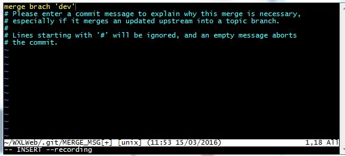

# Git

## 参考资料

- [Git 使用基础篇](http://www.open-open.com/lib/view/open1332904495999.html)
- [Git 教程-廖雪峰](http://www.liaoxuefeng.com/wiki/0013739516305929606dd18361248578c67b8067c8c017b000)
- [Git 飞行规则](https://github.com/k88hudson/git-flight-rules/blob/master/README_zh-CN.md)

## 操作

- [add](./add.md)

## 分支（branch）

以前都是在 dev 上开发，这段时间由于项目频繁发版，所以考虑在新的 feature 分支上开发新功能，网上搜了一些资料，现在记录一下整个流程。

假设远程仓库已经有 `master` 和 `dev` 两个分支。

进入 dev 分支

```bash
git checkout dev
```

基于 dev 分支创建新分支 `feature/A`。新开发的功能以 `feature` 开头，`A` 为功能名称，作为命名规范。

```bash
git branch feature/A
```

切换到 `feature/A` 分支

注意这里还是本地分支，使用 `git branch` 查看本地分支， 会显示 `feature/A` 和 `dev` 两个分支。分支前面有 `*` 代表是当前分支。

使用 `git branch -r` 查看远程分支是没有 `feature/A` 分支的。

```bash
git checkout feature/A
```

把 `feature/A` 分支推送到远程仓库。然后使用 `git branch -r` 查看远程分支， `feature/A` 分支已经存在。

注意：远程分支和本地分支的名称要保持一致。

```bash
git push origin develop
```

完成功能后需要删除本地和远程分支。先用 `git branch -a` 来查看所有分支，包括本地和远程分支。

删除本地分支

```bash
git branch -d feature/A

// 强制删除
git branch -D
```

删除远程分支

```bash
git push origin --delete feature/A
```

今天在同事电脑上使用 `git branch -r` 却看不到我最近新建的远程分支，要先使用 `git fetch` 更新一下才能看到。

现在有个问题，在 `dev` 分支上面修复了 bug （本来应该新建一个分支来修复 bug，现在暂时不考虑，直接在 `dev` 上修复），如何把 `dev` 分支修复后的代码合并到 `feature/A` 分支上？

- 第一步：切换到 `feature/A` 分支；
- 第二步：合并分支 `git merge dev`；
- 完成。

`pull` 或者 `merge` 分支时，有时候会遇到这个界面，如下图：



可以不管(直接下面 3,4 步)，如果要输入解释的话就需要:

1. 按键盘字母 `i` 进入 insert 模式。
2. 修改最上面那行黄色合并信息,可以不修改。
3. 按键盘左上角 `Esc`。
4. 输入 `:wq`，回车。

## 回滚（reset）

今天 pull 代码后，打包出现问题，但是找不到出问题的具体文件。使用排除法来查找具体是哪次提交的问题。
先查看提交的 log，按字母 q 可以退出日志模式。

```bash
git log
```

回滚到具体的某个版本

```bash
git reset --hard e377f60e28c8b84158
```

强制提交

```bash
git push -f origin master
```

恢复版本到一个具体的状态，建议加上 `––hard` 参数，git 支持无限次后悔

```bash
回退到上一个版本：git reset ––hard HEAD^
回退到上上一个版本：git reset ––hard HEAD^^
回退到上N个版本：git reset ––hard HEAD~N（N是一个整数）
回退到任意一个版本：git reset ––hard 版本号（版本号用7位即可）
```

## 解决冲突

1、先将本地修改存储起来

```bash
git stash
# 这样本地的所有修改就都被暂时存储起来
```

使用 `git stash list` 可以看到保存的信息

2、pull 内容

```bash
git pull
```

3、还原暂存的内容

```bash
git stash pop stash@{0}
```

4、解决文件中冲突的的部分

其中 `Updated upstream` 和 `=====` 之间的内容就是 pull 下来的内容。

`====` 和 `stashed changes` 之间的内容就是本地修改的内容。

碰到这种情况，git 也不知道哪行内容是需要的，所以要自行确定需要的内容。解决完成之后，就可以正常的提交了。

## `git warning: LF will be replaced by CRLF in` 解决办法

在使用 git 的时候，每次执行

```bash
git add .
```

都会提示这样一个警告消息：

```bash
warning: LF will be replaced by CRLF in XXXXXXXXXXXXXX.
```

虽然说没有什么影响，但是就是觉得太碍眼了，按照这样设置就没有问题了。

```bash
git config core.autocrlf false
```

这样设置 git 的配置后在执行 add 操作就没有问题了。

参考资料：[git 中配置 autocrlf 来正确处理 crlf](http://blog.csdn.net/lysc_forever/article/details/42835203)

## git bash 客户端添加 node_modules 目录时，遇到长路径提示 file name too long 的解决方案

当遇到以下错误时

```bash
fatal: unable to stat 'node_modules/gulp-connect/node_modules/gulp-util/node_modules/dateformat/node_modules/meow/node_modules/normalize-package-data/node_modules/validate-npm-package-license/node_modules/spdx-expression-parse/parser.generated.js': Filename too long
```

可以使用以下命令来修复：

```bash
git config --system core.longpaths true
```

也可以仅设置当前项目：

```bash
git config core.longpaths true
```

查看设置状态：

```bash
git config core.longpaths
```

## 记住密码

[Https 方式使用 Git@OSC 设置密码的方式](http://git.oschina.net/oschina/git-osc/issues/2586)
